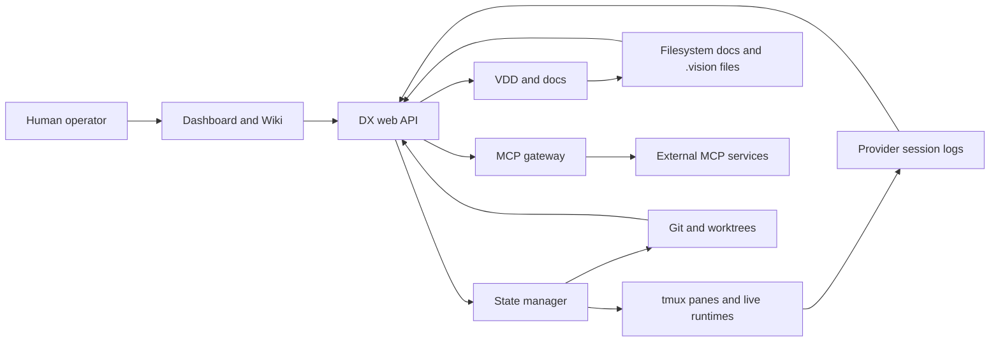
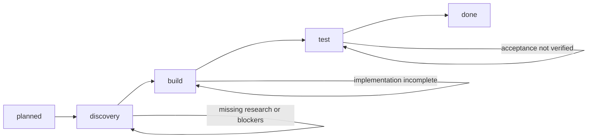
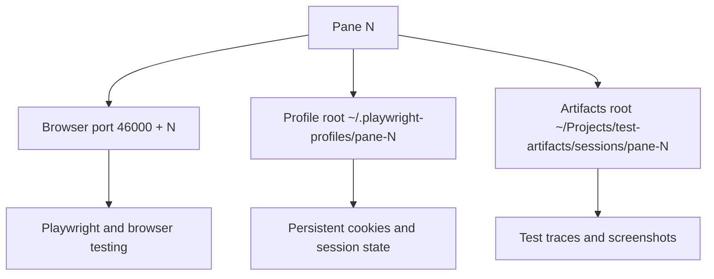
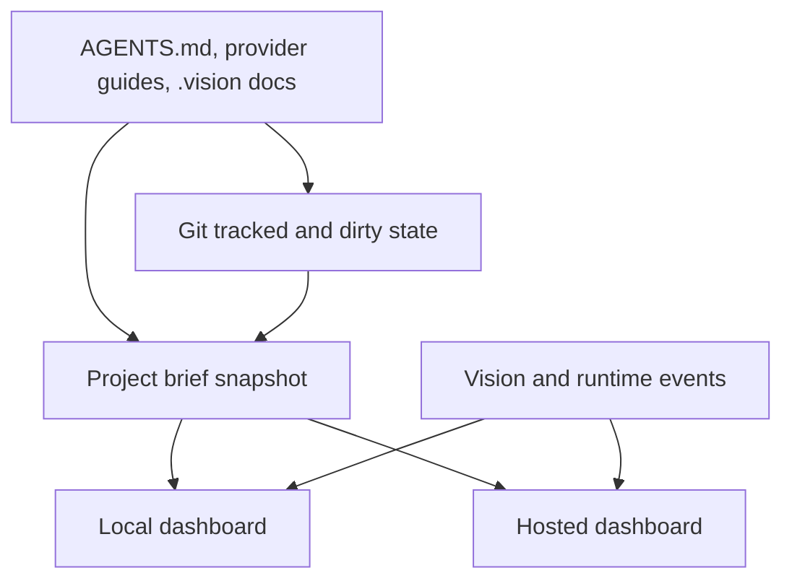

# DX Terminal Architecture Blueprint

## Why This Exists

DX Terminal is not just a terminal multiplexer and not just a project dashboard. It is intended to be a single operating surface that keeps runtime work, documentation, VDD state, git state, and browser testing aligned.

This document explains the technical shape of that system in a way that both operators and developers can use.

## System At A Glance

## Delivery Lifecycle

## Runtime Contract

Each pane is treated as a stable execution lane.

- A pane owns a provider runtime.
- A pane owns a worktree or shared tree context.
- A pane owns a deterministic browser automation contract.

### Browser Automation Contract

This matters because both humans and agents can reason about browser testing without negotiating ports or guessing which profile belongs to which pane.

## Documentation Synchronization

The core rule is simple: the hosted site must consume the same snapshot and event channels as the local dashboard. If it has a second private state model, drift is guaranteed.

## Main Subsystems

### 1. Dashboard and Wiki

Purpose:

- give operators a plain-language view of what is happening now
- show blockers, focus, and current phase
- expose runtime and browser-testing ownership
- surface the documentation state, not just the terminal state

### 2. VDD Engine

Purpose:

- store the mission, goals, features, questions, decisions, tasks, and acceptance criteria
- move work through `planned -> discovery -> build -> test -> done`
- attach discovery and verification evidence to features

### 3. Runtime Observation

Purpose:

- discover live tmux panes
- understand which provider is active in each lane
- tail provider session logs
- expose command, cwd, target, and worktree state

### 4. MCP Gateway

Purpose:

- expose dx-native tools
- bridge external MCP services through one shared registry
- make Playwright and other external tools available to all supported runtimes

### 5. Git and Worktree Layer

Purpose:

- isolate work safely when needed
- expose branch, dirty state, and workspace location
- keep implementation context attached to the runtime lane doing the work

## What Good Looks Like

When DX Terminal is working properly, an operator should be able to answer these questions from one place:

1. What is the product trying to achieve right now?
2. Which feature is active?
3. Which phase is that feature in?
4. What is blocked?
5. Which runtime is implementing it?
6. Which worktree and branch hold the changes?
7. Which browser port and profile belong to that runtime?
8. Which documents explain the work and prove it is complete?

If any of those questions require hunting across multiple tools, the system is not finished.
