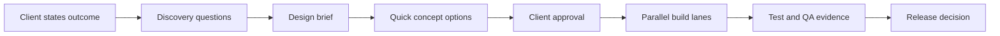
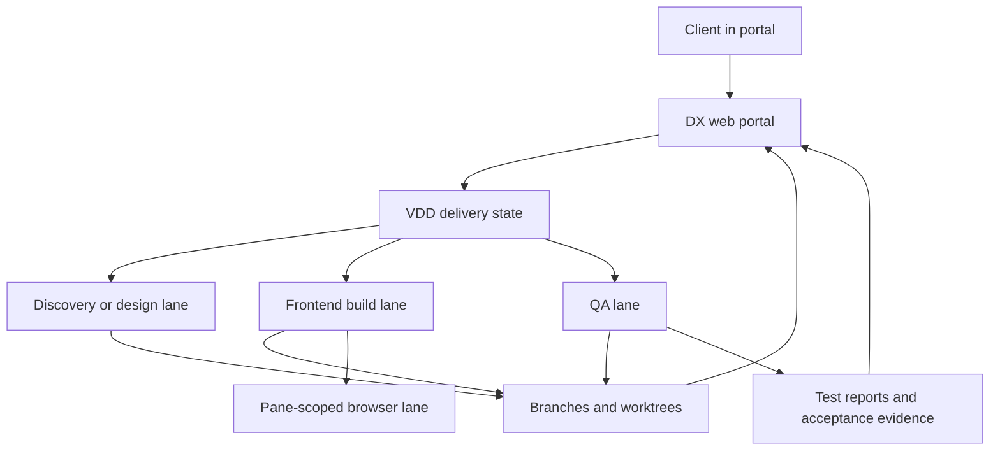

# DX Client Onboarding Blueprint

## Why This Document Exists

If DX is going to replace scattered project tools, the onboarding flow cannot be implied. A client needs to understand:

- what happens first
- what decisions they will be asked to make
- what the team is doing behind the portal
- when work is considered ready to move forward

This document describes the intended onboarding journey from the client point of view.

## One-Screen Summary

## What The Client Should Experience

### 1. Clear opening prompt

The client should be able to start with an outcome, not a ticket.

Example:

> I want a website like Shopify for our service business. It should feel premium, fast, and easy for non-technical buyers.

The portal should then turn that into structured discovery instead of asking the client to think like a project manager.

### 2. Guided discovery

The portal should ask in plain language:

- who is buying
- what they are trying to do
- which references feel right
- which references feel wrong
- what pages or flows matter most
- what legal, trust, or operational constraints exist

### 3. Visible design direction

The client should then see:

- a short design brief
- two or three quick concept directions
- a plain-English explanation of the differences

This is the approval point that keeps build from running ahead of the wrong idea.

### 4. Delivery without tool switching

After approval, the client should remain in the portal and see:

- current stage
- what is being built
- what is being tested
- what changed since approval
- what evidence exists

The client should not need Jira, Confluence, GitHub branches, or terminal screenshots to understand the project.

## Behind The Portal

The key rule is that specialist execution happens behind the portal, but remains visible through the same shared story.

## Example: “A Website Like Shopify”

The onboarding flow should look like this:

1. The client enters the goal, audience, and references.
2. Discovery asks follow-up questions:
   - Are you selling a product, service, or both?
   - What should a visitor do in the first 30 seconds?
   - What brands feel too playful, too technical, or too generic?
   - What proof or trust signals must appear?
3. The portal creates:
   - a discovery brief
   - acceptance criteria
   - a design brief
4. The system generates quick concepts:
   - polished ecommerce-like
   - premium editorial
   - product-led conversion
5. The client approves one direction.
6. The work splits behind the scenes:
   - copy and information architecture
   - design system and layout
   - implementation
   - device/browser QA
7. The portal tracks progress through build, test, and release.

## Approval Rules

For client-facing work, `build` should not be trusted until all of these exist:

- discovery notes
- open questions resolved or intentionally deferred
- acceptance criteria
- design brief
- at least one quick concept
- one approved direction

For `done`, the portal should show:

- verified acceptance criteria
- test evidence
- documentation synced
- Git state acceptable for release

## What Good Looks Like

A client should be able to say:

- I understand what the team believes we are building.
- I can see which direction was approved.
- I can tell whether the team is still figuring things out, building, or testing.
- I can review progress without opening engineering tools.
- I can trust that the documentation matches the live work.

If the portal cannot support those sentences, onboarding is still incomplete.
