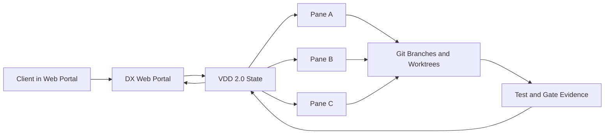

# Client Portal Playbook

The client should experience DX Terminal as a web portal, not as a terminal multiplexer.

## What The Client Sees

1. A clear project brief.
2. Discovery questions written in plain language.
3. Quick design directions and sample mockups.
4. A visible approval point before build starts.
5. Live progress through build, test, and release readiness.

## What The Team Sees

The team still works through DX Terminal panes, worktrees, branches, tests, and MCP tools. The portal is the control surface. The panes are the execution surface.

## Client Journey

### Discovery

The client states the outcome they want, not the implementation. Example:

> I want a website like Shopify, but for our service business. It should feel modern, premium, and easy for a non-technical buyer.

The portal should then capture:

- business goal
- audience
- reference products
- required pages or flows
- trust requirements
- technical constraints

### Design

Before implementation starts, the system should produce:

- a design brief
- two to three quick mockup directions
- a short explanation of the difference between each option

The client should be able to react with simple decisions:

- approve this direction
- reject this direction
- request changes

### Build

Once a direction is approved, the portal should unlock build. The team can then work in parallel across panes and branches, but the client still stays in the portal.

### Test

The client should see:

- what was tested
- what passed
- what still needs review
- what changed since the approved direction

## Example: Shopify-Like Website

If the request is "build a website like Shopify", the portal flow should be:

1. Start discovery and ask for the offer, audience, and conversion goal.
2. Record references like Shopify, Stripe, Linear, or Vercel.
3. Generate quick concept directions.
4. Let the client approve one direction.
5. Split implementation into branch-scoped work:
   - content and information architecture
   - design system and layout
   - frontend implementation
   - QA and device testing
6. Keep documentation, git, and test evidence synced back into the same portal.

## Approval Rule

For client-facing features, build should not start just because discovery notes exist. Build should start when:

- discovery questions are resolved
- acceptance criteria exist
- a design brief exists
- at least one mockup direction exists
- the client has approved a direction

## Hosted Portal Rule

The hosted website and the local dashboard must consume the same project brief and event model.

- Snapshot source: `/api/project/brief`
- Live event source: `vision_changed`, `focus_changed`, runtime events

The hosted portal must not maintain a separate project state model.
