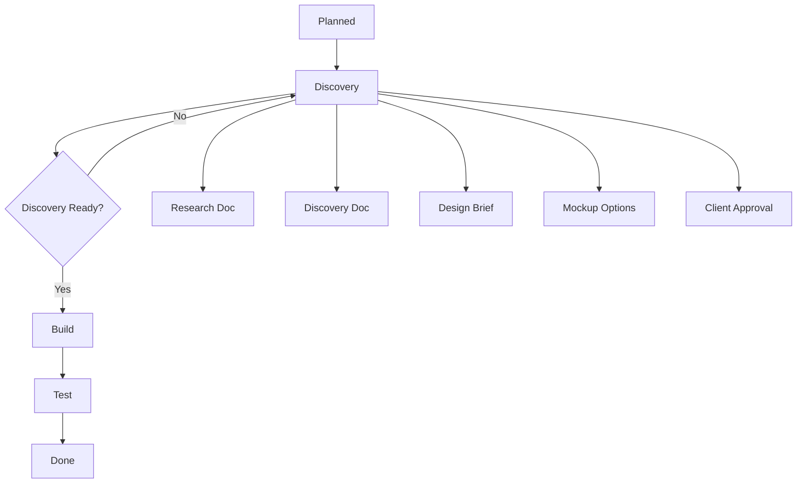
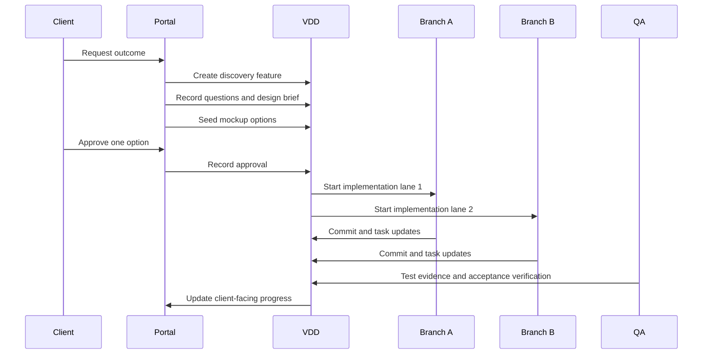

# Discovery And Design Playbook

Discovery and design should run together for client-facing features.

## Why

Teams lose time when they treat design as a late-stage polish step. For a portal that replaces Confluence, Jira, BA handoff, and QA visibility, the client has to react early to something tangible.

That means discovery should not end with only text notes. It should end with:

- explicit questions
- explicit acceptance criteria
- explicit design brief
- explicit mockup options
- explicit approval

## Stage Contract

## Discovery Checklist

### Always required

- research or discovery artifact
- blocking questions resolved
- acceptance criteria documented

### Required for client-facing features

- design brief
- quick mockup options
- one approved direction

## What Counts As Client-Facing

The system should assume design is required for features that involve:

- websites
- dashboards
- portals
- onboarding flows
- customer workflows
- branded UX
- frontend experiences

## Mockup Standard

Mockups do not need to be production code. They need to answer:

- what is the first impression?
- what is the information hierarchy?
- what proof builds trust?
- what action should the client or end-user take?

## Approval Standard

Approval should be recorded in the portal and attached to the feature itself.

Minimum record:

- approved option ID
- actor
- timestamp
- optional note

## Parallel Delivery Model

## Human Explanation

The portal should always be able to explain:

1. what problem is being solved
2. what direction was approved
3. what is being built now
4. what is under test
5. what remains before release

If the portal cannot explain those five things, the workflow is incomplete.
