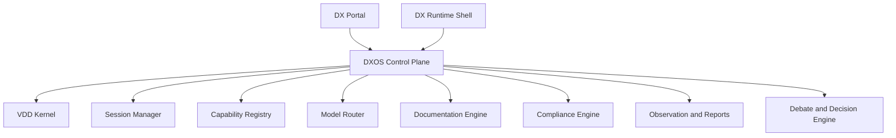

# DXOS Master Architecture

## Purpose

DX Terminal is no longer just a terminal multiplexer with vision tracking. The target product is `DXOS`: a multi-tenant AI operating system with a portal, a runtime shell, and a control plane.

This document is the top-level architecture statement for that direction.

## Product Shape

DXOS has two primary user surfaces:

- `DX Portal`
  - client onboarding
  - discovery and design approvals
  - delivery, QA, security, and release visibility
  - company admin and provider setup
- `DX Runtime Shell`
  - high-speed operator and agent execution shell
  - custom PTY substrate
  - scoped sessions, browser ownership, and live supervision

Behind both sits one shared control plane.

## Core Platform Model

The control plane owns:

- `Tenant`
- `Company`
- `Program`
- `Workspace`
- `Project`
- `Repo`
- `Environment`
- `Feature`
- `Stage`
- `Session`
- `AgentRole`
- `Capability`
- `Workflow`
- `Artifact`
- `Approval`
- `ComplianceProfile`
- `Report`
- `Incident`
- `Debate`
- `Proposal`
- `Contradiction`
- `Vote`
- `DecisionRecord`

The delivery stages are:

- `planned`
- `discovery`
- `design`
- `build`
- `test`
- `done`

## Runtime Model

The primitive is `session`, not pane.

Each session carries:

- tenant/company/project/workspace
- role
- provider/model
- autonomy level
- allowed repos and directories
- branch/worktree binding
- allowed capabilities
- browser profile and port ownership
- expected outputs
- escalation path

DXOS now exposes a brokered runtime model with:

- `pty_native_adapter` as the default substrate
- `tmux_migration_adapter` as the compatibility path
- provider inventory that declares preferred and supported adapters per runtime
- server-side auto-allocation of the next free lane when operators launch a session without binding it to a specific pane up front
- HTTP control-plane launch endpoints, so hosted portals and local dashboards can create lanes without depending on a WebSocket-only spawn path
- HTTP pane-control endpoints for `talk` and `kill`, so hosted portals can supervise live lanes through the control plane while WebSocket remains focused on live streaming and event delivery
- HTTP pane restart endpoints, so recovery actions also stay inside the control plane instead of depending on a local socket or manual terminal intervention
- SQLite-backed DXOS control-plane storage as the canonical backend, with the repo-local `.dxos/control-plane.json` retained only as a compatibility mirror

tmux remains a migration adapter only. The target substrate is DX-owned PTY sessions, and the operator surfaces now render adapter choice and live substrate state explicitly.

## Governance and Reasoning

DXOS uses a structured council model for important reasoning.

The built-in debate workflow is:

1. start debate
2. submit proposals
3. submit contradictions
4. cast votes
5. synthesize and finalize decision

Every decision should preserve:

- rationale
- evidence refs
- dissent or contradiction
- final synthesizer
- linked feature or stage

This is how the system supports invention-grade work without reducing reasoning to one model’s answer.

## Documentation Contract

Documentation is a hard dependency, not a later summary.

Key document classes include:

- Company Handbook
- Program Charter
- Project Brief
- Discovery Brief
- Design Review
- Architecture Spec
- Decision Log
- Research Brief
- Debate Record
- Test Plan
- Verification Report
- Security Review
- Compliance Pack
- Release Packet
- Incident Report

Documentation is compiled from:

- workflow events
- Git and repo state
- artifacts
- approvals
- human edits
- debate records

Stage transitions should fail when required documentation is missing or stale.

## Compliance and Security

DXOS must treat compliance as native system behavior.

Baseline requirements:

- SOC 2-aligned control evidence
- jurisdiction-specific policy profiles
- data residency restrictions
- provider and capability restrictions by company or project
- immutable audit trails
- approval history
- human handoff for MFA, login challenge, and sensitive actions

## Implementation Direction

The current repo already contains useful seeds:

- VDD lifecycle and docs
- provider runtime monitoring
- MCP bridging
- dashboard and wiki contracts
- live event system

The next major direction is to consolidate those into:

1. a database-backed control plane
2. a DX-owned session runtime
3. a provider-neutral capability registry
4. a formal documentation and decision engine
5. a multi-surface product where portal and shell are equal clients of the same truth

## Current First Slice

The first architecture slice now implemented in the repo is:

- project-scoped DXOS control-plane state
- formal debate engine
- native session contracts and delegated work orders
- MCP and web APIs for proposal, contradiction, vote, and decision flows
- MCP and web APIs for session upsert, status updates, delegation, blocking, and resolution
- live `debate_changed` and `dxos_session_changed` events
- portal execution hub surfaces DXOS session contracts, delegated work, blocker queues, and recent decision records
- runtime cards now carry `dxos_session_id`, so pane state and control-plane session state line up from first render
- blocked work orders can be resumed directly from the portal, and mapped sessions can jump straight into their pane
- portal-native operator controls can now launch a real runtime lane on the current adapter, register provider-neutral session contracts, delegate structured work, and start formal debates without dropping into raw terminal commands
- DXOS debate/session events now update the execution hub surgically instead of forcing a full page refresh, so the portal can evolve into a stable control surface rather than a passive monitor
- the tmux migration adapter now launches provider-specific lanes for Claude, Codex, and Gemini, with provider/model persisted in pane state and reflected back into the portal and DXOS session contract
- runtime launch is no longer “Claude plus labels”; provider choice now flows from the portal form, through the websocket spawn command, into the runtime broker, and back into the control plane
- DXOS now publishes a role-and-stage provider policy matrix, so the portal can explain which runtimes are preferred or allowed before a lane is launched
- session contracts now persist `policy_violations` and `last_error`, which gives the portal a durable way to surface blocked provider choices and failed runtime launches instead of silently dropping them
- runtime lanes are registered in DXOS before the adapter launches, so failed launches still leave behind a supervised session record with the intended feature, stage, and supervisor context
- provider-native launch planning now lives in a DX runtime broker instead of inside the tmux adapter, so provider binary discovery, command construction, and launch policy are separated from window creation
- tmux is now explicitly a migration adapter that executes brokered launch plans; the DXOS runtime contract and project brief both advertise the broker and supported providers directly
- DX now owns a provider-plugin bridge layer, so native Claude MCP registrations and DX-managed Codex/GPT and Gemini bridge files all merge into one shared manifest and can be exported back out as provider-specific plugin configs
- the portal, MCP surface, and API now expose provider bridge inventory and sync operations, which makes “Claude MCP -> GPT/Gemini bridge” a first-class system capability instead of a manual copy step
- runtime lane launch now auto-syncs the selected provider bridge and injects its path into the lane environment, so interoperability is part of execution instead of a separate operator chore
- DX now applies the same bridge model to skills and command packs: the shared automation catalog can be exported into Claude, Codex/GPT, or Gemini local layouts without overwriting user-owned assets
- lane launch now auto-syncs those automation bridges too, so reusable workflows travel with the runtime instead of staying trapped in one provider’s directory tree
- DX now emits a structured shared workflow catalog from those bridged skills and command packs, so provider-local assets also exist as DX-owned workflow objects with IDs, sections, and step lists
- DXOS can now instantiate those catalog entries as governed workflow runs, creating linked session and work-order contracts and tracking step status natively inside the control plane
- workflow runs publish their own live change events, appear in the project brief and operator portal, and can be queued from the web surface instead of being treated as passive documentation
- worker sessions can now raise blockers or permission requests through DXOS session context, and the control plane routes those requests to the supervising lead first before falling back to explicit human escalation
- runtime lanes now receive `DXOS_SESSION_ID`, `DX_FEATURE_ID`, `DX_STAGE`, and `DX_SUPERVISOR_SESSION_ID` so agents in a live lane can report blocker and approval state without reconstructing their control-plane identity
- the server-owned runtime replicator now detects clear approval/login/challenge prompts in live pane output and converts them into DXOS blocker events once, so “waiting for human action” is lifted out of raw terminal text and into the control plane
- resolving a blocked work order now persists an explicit resolution note and pushes that guidance back into the worker lane automatically through the live runtime target when one exists
- if DXOS can clear the blocker but cannot reach the worker lane, the failure is recorded back onto the session contract so the portal still shows the unresolved operational gap
- the stop hook now continues work while the next high-value task remains clear, which keeps auto-continue aligned with DXOS language instead of relying on looser “obvious next step” wording
- SQLite-backed DXOS control-plane storage is now the canonical backend, the repo-local `.dxos/control-plane.json` remains only as a compatibility mirror, and the portal exposes both the store paths and the registered-project registry so operators can see which state is authoritative
- mutating DXOS and pane-control HTTP routes can now be protected with a server-side `DX_CONTROL_TOKEN`, and the runtime contract publishes the auth mode so a hosted portal can distinguish trusted local control from token-gated operations
- every protected portal control mutation now lands in a canonical DXOS audit log inside the shared SQLite store, and the execution hub surfaces those records so operator actions are reviewable without reading raw server logs
- the portal can now stamp a session-scoped operator identity onto protected control requests, so the audit trail is no longer limited to a generic control token holder label
- the project brief now carries a recovery/adoption assessment, so DXOS can explain what is missing on a half-started project and prefill the next governed specialist lane directly from the portal
- recovery/adoption planning now lives in a shared planner module instead of inside the web surface, so `project/brief`, portal adoption, and MCP adoption all derive the same next governed package and follow-on specialist suggestions
- the portal now derives client, reviewer, and operator presentation modes from the same control policy, so restricted identities can stay inside a client-safe delivery view while operators retain full runtime and delegation controls
- DXOS project adoption is now a first-class control-plane action: the portal or MCP can seed a governed recovery lead session plus a formal adoption council in one step, and the resulting adoption record is visible in the project brief and recovery rail
- seeded adoption lead contracts can now be launched directly into a live runtime lane, so DXOS no longer forces operators to recreate a planned recovery session manually before execution starts
- seeded adoption now also creates an assigned recovery work package, and the launch path injects that work package plus adoption/council context into the live lane prompt and shared guidance files automatically
- when adoption is marked complete, DXOS now seeds the first planned specialist follow-on session and work-order contracts from that same recovery planner output, so recovery turns into governed downstream execution instead of ending at a status flip
- the operator launch surface now reads those seeded follow-on contracts as a priority queue and auto-seeds the launch form from the first planned specialist lane until the operator takes manual control
- protected control routes now enforce optional operator policy as well as token auth, so named operators can be limited by role, project scope, and action families before a launch, debate, or lane mutation is accepted

That gives the platform a native place to reason, disagree, decide, supervise, and delegate inside the system itself.
