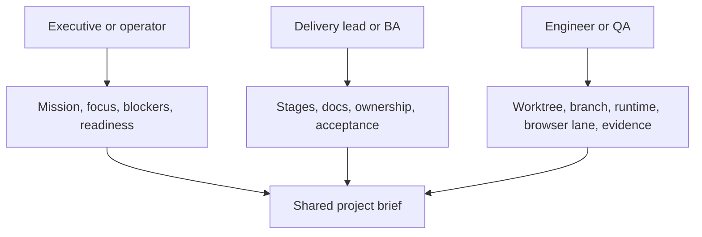
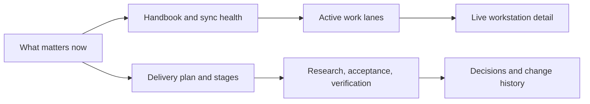

# DX Terminal Experience Blueprint

## Goal

DX Terminal should feel like a delivery operating system, not a developer-only telemetry board.

A non-technical operator should be able to understand what is happening. An engineer should still be able to drill all the way down into live runtime details.

## Audience Layers

## Product Surfaces

DX Terminal has three primary surfaces:

### 1. Dashboard

Purpose:

- answer what matters now
- show whether docs and work are aligned
- identify active runtimes and owners
- expose blockers and next gates

### 2. Runtime Panel

Purpose:

- inspect one execution lane in detail
- view terminal output and session events
- understand worktree, browser lane, and context
- send focused instructions to a runtime

### 3. Wiki

Purpose:

- teach humans how the system works
- preserve project history, architecture, and decisions
- provide discovery, QA, and operator context
- act as the readable memory of the program

## Information Architecture

## Readability Rules

The product should follow these rules:

- important information must appear before raw operational noise
- stage language must be human-readable
- color should clarify meaning, not merely decorate status
- the same concept should use the same label across dashboard, wiki, and API
- the interface must work for mixed runtimes, not one preferred provider

## Visual Direction

The intended direction is:

- calm, high-contrast typography
- restrained accent colors
- explicit phase badges
- paper-like documentation surfaces
- darker terminal surfaces where raw terminal output is shown

This means the wiki can feel editorial and readable, while the live terminal panel can remain operational and dense.

## Operator Reading Order

The dashboard should be readable in this order:

1. mission and active focus
2. stage and blockers
3. documentation health
4. active runtime lanes
5. detailed runtime grid
6. deeper plan, queue, and historical context

If the page encourages people to start with raw terminal noise, the experience is backwards.

## Runtime Card Contract

Every runtime card should answer:

- who or what is running here
- which project or feature it belongs to
- which stage the work supports
- which worktree or branch contains the work
- which browser lane belongs to that runtime

## Wiki Contract

The wiki should always contain:

- executive overview
- operator guide
- system architecture
- hosted sync model
- delivery stage explanation
- research and discovery notes
- architecture decisions
- historical changes

## Product Standard

A strong DX Terminal experience lets a new person understand the current program in minutes, then drill down into evidence without leaving the product.
