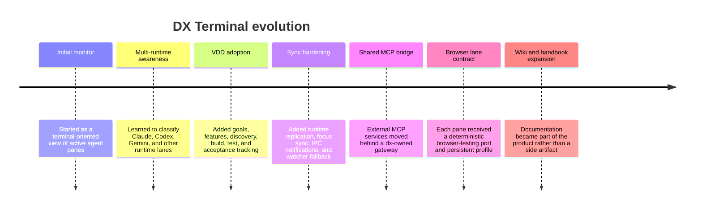
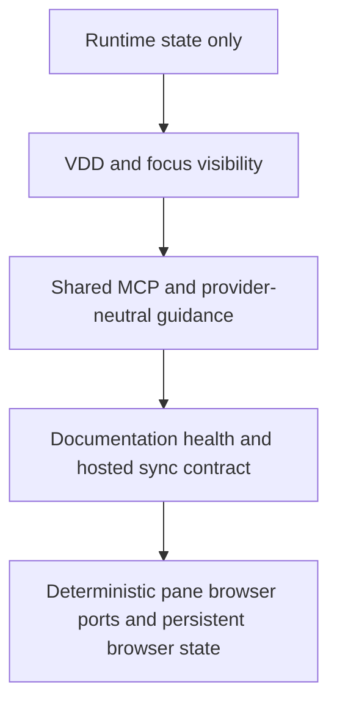

# History Of DX Terminal

## Why A History Document Exists

Most engineering tools become harder to understand over time because the original intent gets lost. This document keeps a readable record of how DX Terminal evolved and why the current architecture looks the way it does.

## Timeline

## Major Shifts

### From Pane Monitor To Control Plane

Early versions were mostly about watching running panes. That solved local visibility, but it did not solve project state, documentation state, or handoff quality.

The system had to grow into a control plane that answers:

- what is being built
- why it is being built
- who or what is working on it
- what evidence exists that it is correct

### From Provider-Specific To Provider-Neutral

The system originally carried more Claude-specific assumptions than it should have. That made short-term implementation easier, but it would have created strategic lock-in.

The current direction is explicit:

- shared guidance first
- shared MCP registry first
- shared VDD state first
- provider overlays second

### From Manual Coordination To Contracted Coordination

Several critical workflows were too implicit:

- choosing browser ports
- mapping runtime focus
- understanding which docs were authoritative
- deciding whether local and hosted dashboards were in sync

The product is moving those from habit into explicit contracts so operators do not need tribal knowledge.

## What Changed Recently

Recent work concentrated on four areas:

1. making the VDD lifecycle visible and phase-aware
2. synchronizing focus across dashboard, hooks, and MCP surfaces
3. moving external MCP ownership toward a dx-managed contract
4. making browser automation deterministic per pane

## Why The History Matters

Without this history, future contributors will be tempted to reintroduce the exact classes of drift the system is trying to remove:

- provider-specific state
- UI-only state with no backend contract
- documentation that is not tied to execution
- browser automation that depends on temporary ports and human memory

## Strategic Direction

The long-term direction is not "more metrics" or "more cards." It is a clear operating system for software delivery.

That means:

- humans can understand it
- agents can act through it
- documentation explains the current system instead of trailing behind it
- hosted and local views share the same truth
