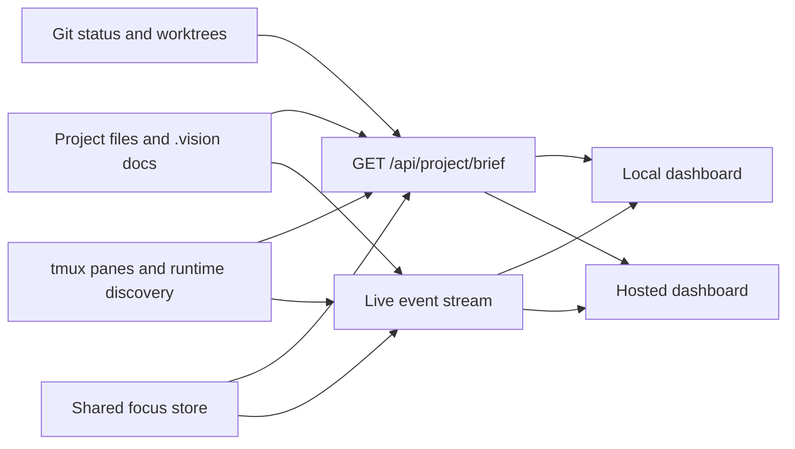
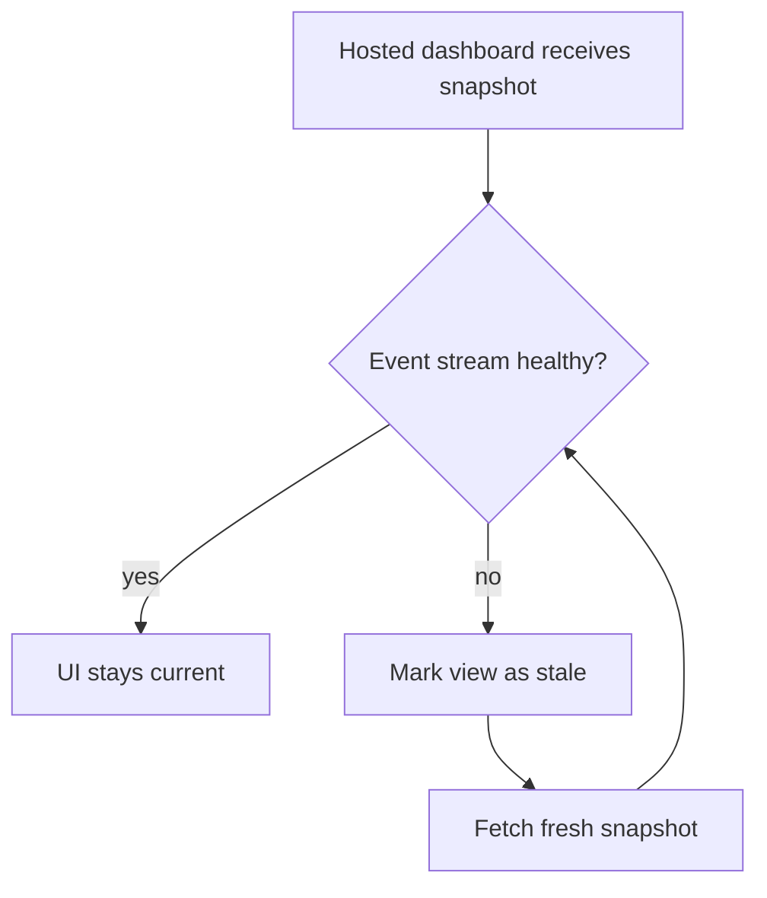

# Hosted Sync Model

## Purpose

DX Terminal must support both a local operator dashboard and a hosted website without creating two competing versions of project truth.

This document defines the rule that keeps them aligned.

## Core Rule

The hosted experience must consume the same snapshot and event contracts as the local dashboard.

It must not keep its own hidden planning state, document cache, or runtime interpretation layer.

## Synchronization Contract

## Authorities

These are the sources that define reality:

- `.vision/vision.json`
- `AGENTS.md` and provider overlays such as `CLAUDE.md`, `CODEX.md`, and `GEMINI.md`
- research and discovery docs under `.vision/research` and `.vision/discovery`
- git status, branch state, and worktree state
- runtime metadata discovered from tmux and provider logs

The local dashboard and hosted dashboard are read models over those authorities.

## Required Behavior

### Local Dashboard

The local dashboard should:

- read the project brief snapshot
- subscribe to live updates
- show documentation drift immediately
- never invent local-only VDD state

### Hosted Dashboard

The hosted dashboard should:

- consume the same `project/brief` snapshot
- subscribe to the same live event schema or a relayed equivalent
- display stale/offline status clearly when events are delayed
- avoid any separate editing workflow that bypasses the local authority model

## Event Model

The hosted site only stays trustworthy if it follows the same event semantics as localhost.

Important events include:

- `vision_changed`
- `focus_changed`
- `sync_event`
- `sync_status`
- `pane_upsert`
- `pane_removed`
- `pane_status`
- `terminal_output`
- `session_events`
- `queue_upsert`
- `queue_removed`

## Failure Model

If the event stream drops, the hosted site should degrade visibly and then resync from the snapshot contract.

## What Must Never Happen

These patterns break trust:

- a hosted site with a private cache of feature state
- a documentation page generated from stale exported markdown
- runtime ownership shown differently on localhost and on the website
- browser testing metadata omitted on one surface but not the other

## Practical Outcome

If someone opens DX Terminal locally and another person opens the hosted website, they should agree on:

- the current mission
- the active feature focus
- the current stage of work
- which runtimes are active
- which worktree and branch hold the implementation
- whether the documentation is in sync

If they cannot agree on those facts, the sync model is broken.
