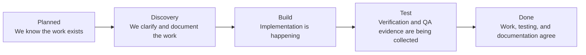

# DX Terminal For Non-Technical Operators

## What This Product Does

DX Terminal helps a team understand software delivery without reading raw code or watching terminals all day.

Think of it as one place that answers:

- what the team is trying to build
- what is happening right now
- what is blocked
- which specialist is working on what
- whether testing and documentation are keeping up

## How To Read The Main Screen

### Program Brief

This is the "what and why" section.

Use it to understand:

- the current mission
- which feature matters most right now
- which stage the work is in
- what is ready to move forward
- what is blocked

### Documentation Sync

This tells you whether the written explanation of the project matches the live system.

If this area says the system is out of sync, it means one of these things has drifted:

- project documentation
- VDD state
- git state
- dashboard view

### Runtime Lanes

These are the active workstations.

Each lane tells you:

- which provider or specialist is active
- what task they are doing
- which branch or worktree holds the work
- which browser testing lane belongs to them

### Live Workstations

This is the operational grid. It is useful when you want to see what is active right now, but it should not be the only part of the product you rely on.

The top-level brief and documentation sections are usually more important for decision making.

## Delivery Stages In Plain English

## What A Good Operator Does

1. Read the program brief before reacting to the live terminal lanes.
2. Check the active focus so you know which feature the system is centered on.
3. Confirm the feature stage.
4. Check whether the blockers are documentation, implementation, or testing related.
5. Use the runtime lanes only after you understand the context from the brief.

## Why Browser Ports Matter

Browser testing can become confusing fast if people keep opening random sessions on random ports.

DX Terminal avoids that by giving each pane its own stable browser lane.

That means:

- the operator knows where screenshots and traces belong
- the runtime knows which browser session to reuse
- tests can be repeated without guessing

## What Success Looks Like

A non-technical operator should be able to say:

- "I understand the mission."
- "I know which feature is active."
- "I know whether the work is still being figured out, built, or tested."
- "I know who owns the browser testing lane for that work."
- "I know whether the documentation matches reality."

If the system cannot support those sentences clearly, the interface still needs work.
