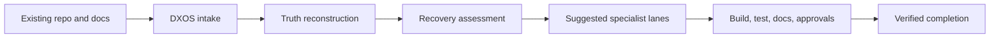
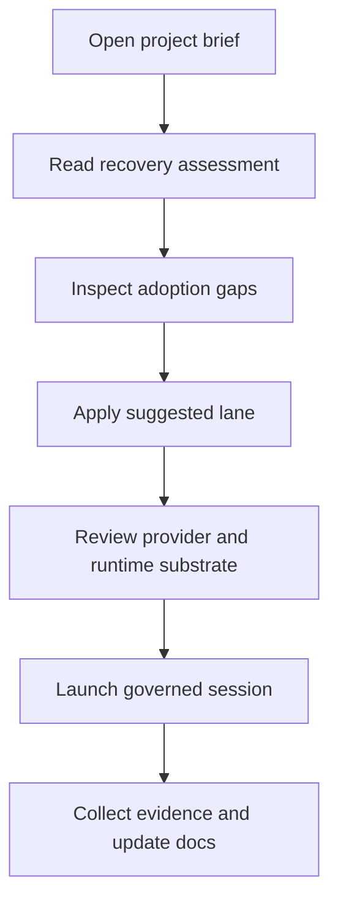

# DX Project Adoption And Recovery

## Why This Exists

Most real projects do not begin cleanly. They arrive half-started:

- code exists but the feature map is incomplete
- branches and worktrees exist but ownership is unclear
- some UI is built but approvals are missing
- documentation is partial or stale
- tests exist in fragments
- the client does not know what is actually done

DXOS needs to do more than track new work. It needs to adopt unfinished work, reconstruct the truth, and drive it to a verified finish.

## Current DXOS Behavior

Project adoption is now a governed control-plane action, not just dashboard advice. Starting adoption seeds:

- a recovery `lead` session contract
- a formal adoption council debate
- an initial assigned recovery work package bound to that lead

When the operator launches that lead lane, DXOS now injects the assigned work package, adoption summary, and recovery council context directly into the runtime prompt and shared lane guidance. The recovery lane does not start from a blank brief anymore.

The portal no longer hand-builds that first package. It now asks DXOS to start governed recovery, and the backend derives the initial summary, objective, feature, and stage from the same `project/brief` recovery model that powers the adoption rail.

That same shared recovery planner now also supplies the first follow-on specialist suggestions. When adoption is marked complete, DXOS seeds planned specialist session contracts and work orders under the recovery lead instead of stopping at a closed recovery ticket.

The operator portal now surfaces those seeded follow-on lanes as a queue. The launch form auto-seeds from the first planned follow-on lane until the operator makes a manual edit, and each queued lane can be applied to the form or launched directly.

That queue is no longer only an adoption-side convenience. DXOS now derives a scheduler-backed `launch_queue` from the control plane itself, so recovery follow-ons, planned workflow runners, and other governed specialist sessions all compete in one ordered execution view. The same scheduler also emits an `attention_queue` for blocked work that needs lead or human intervention.

The scheduler is now controllable two ways: a local autorun loop can watch the queue continuously, and operators or future hosted orchestrators can force one scheduling tick through the dedicated `scheduler_run` control endpoint/tool. When autorun is enabled, adoption start/completion and other queue-producing DXOS mutations now kick the scheduler immediately instead of waiting for the next poll window.

## Core Promise

If a company points DXOS at an in-progress project, the platform should be able to:

1. ingest the current project state
2. identify what is missing
3. explain the recovery plan in plain language
4. launch the right specialist lanes
5. keep docs, Git, runtime state, and approvals synchronized
6. move the project to a trusted release state

## One-Screen Model

## What DXOS Must Reconstruct

When DXOS adopts a project, it should rebuild these facts before pretending work is under control:

- which features exist
- which stage each feature is actually in
- which approvals are missing
- which docs are missing or stale
- which acceptance criteria are absent
- which runtime lanes are active
- which branches and worktrees are live
- which blockers are preventing the next stage

This is why the project brief now carries a `recovery` block instead of only a live status snapshot.

## Recovery Modes

### 1. `unscoped`

The repo has code, runtime activity, or docs, but DXOS does not yet have a trustworthy feature map.

DXOS response:

- launch a discovery or lead recovery lane
- inventory existing work
- map features and stages
- create the first structured plan

### 2. `structured_planning`

The project has defined features, but the execution network is not fully active yet.

DXOS response:

- identify what is ready
- identify what specialist lanes are missing
- suggest the next governed launch

### 3. `adopt_in_progress`

The project is already in motion and needs a recovery pass rather than a blank-start plan.

DXOS response:

- highlight blockers
- surface missing docs or acceptance coverage
- show missing client approvals
- recommend the next recovery lane immediately

## Recovery Assessment Inputs

The current recovery model uses:

- feature phase counts
- documentation health
- blocked features
- ready features
- client review queue
- active runtime count
- worktree count

This gives DXOS enough signal to say:

- the project needs discovery reconstruction
- the project needs design approval
- the project needs a lead recovery lane
- the project needs QA or docs cleanup before it can be trusted

## Suggested Specialist Lanes

Recovery is only useful if it becomes action.

DXOS should recommend specialist lanes such as:

- `discovery` when research or discovery docs are missing
- `design` when client approval is blocking build
- `frontend` or `build` when work is ready but no lane is active
- `qa` when acceptance or verification evidence is missing
- `docs` when handbook and Git have drifted
- `lead` when blockers need routing, sequencing, or approvals

Those suggestions should not live only in prose. They should prefill governed operator controls directly in the portal.

For adoption specifically, the first suggestion is now materialized as a real DXOS work package rather than a generic “launch a lead” recommendation.
The remaining specialist suggestions are preserved on the adoption record and become planned follow-on lanes when the recovery lead completes the adoption workflow.

## Operator Flow

## Client-Facing Outcome

The client should not see “we found a messy repo.”

The client should see:

- what has already been understood
- what is still missing
- what is waiting for approval
- what specialist work is happening now
- what must happen before release is trusted

That is the real value of recovery mode. It turns inherited chaos into a readable delivery narrative.

## Completion Standard

A recovered project should not be called complete until these are aligned:

- feature and stage map
- discovery and design history
- implementation state
- test and acceptance evidence
- documentation health
- release readiness

If any of those are missing, DXOS should continue to describe the project as adopted but incomplete.
