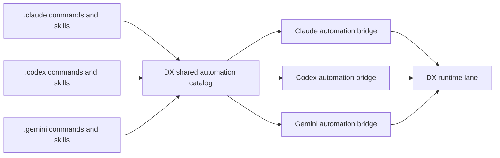

# Provider Automation Interop

DX now bridges reusable `skills` and `command packs` the same way it already bridges MCP servers.

## Why This Exists

Provider-specific workflow assets were a real gap:

- Claude commands and skills lived in `.claude/`
- Codex commands and skills lived in `.codex/`
- Gemini commands and skills lived in `.gemini/`
- DX could inventory them, but not translate them

That meant MCP interoperability existed, but workflow interoperability did not.

## Contract

DX now treats provider-local skills and commands as a shared automation catalog.

For a given project, DX can:

1. scan project-level and user-level provider directories
2. build one deduplicated DX catalog for:
   - commands
   - skills
3. export those assets into a target provider’s local directory structure
4. write a DX-managed manifest describing what was exported
5. refuse to overwrite user-owned files unless they are already DX-managed

## Safety Model

DX-managed exports are marked with a header comment:

```html
<!-- dx-automation-bridge: {...} -->
```

That allows DX to:

- update its own exports safely
- detect user-owned assets
- preserve local customizations that DX does not own

If a target file already exists and is not DX-managed, the bridge reports a conflict and skips it.

## Files Written

Each target provider gets generated assets in its normal local layout:

- commands:
  - `.<provider>/commands/<name>.md`
- skills:
  - `.<provider>/skills/<name>/SKILL.md`

DX also writes an inventory manifest:

- `.<provider>/dx-automation-plugin.json`
- `.<provider>/dx-workflow-catalog.json`

This happens at both scopes:

- project scope: inside the project root
- user scope: inside the user’s home provider directory

## Runtime Behavior

Lane launch now auto-syncs:

- MCP provider bridge
- automation bridge for commands and skills

Each runtime receives:

- `DX_AUTOMATION_BRIDGE_PROJECT_PATH`
- `DX_AUTOMATION_BRIDGE_USER_PATH`
- `DX_AUTOMATION_BRIDGE_PROJECT_ASSETS`
- `DX_AUTOMATION_BRIDGE_USER_ASSETS`
- `DX_AUTOMATION_GUIDE_PATH`
- `DX_WORKFLOW_CATALOG_PROJECT_PATH`
- `DX_WORKFLOW_CATALOG_USER_PATH`

That makes workflow interoperability part of runtime startup instead of a separate operator chore.

DX also writes a workspace guide:

- `DX_AUTOMATION.md`
- `DX_GUIDANCE.md`
- `DX_<PROVIDER>_GUIDANCE.md`

That file gives the launched lane a concise summary of the shared commands, skills, and manifest paths for its provider bridge.

When DX mirrors guidance into `AGENTS.md`, `CLAUDE.md`, `CODEX.md`, or `GEMINI.md`, it only updates DX-managed files. User-owned guidance is preserved.

## Runtime Bootstrap

DX now pushes this contract into runtime command construction too.

Each provider adapter prepends a DX bootstrap section to the launched prompt that tells the runtime to treat these as canonical:

- `DX_SHARED_GUIDANCE_PATH`
- `DX_PROVIDER_GUIDANCE_PATH`
- `DX_AUTOMATION_GUIDE_PATH`
- `DX_PROVIDER_BRIDGE_PATH`
- `DX_AUTOMATION_BRIDGE_PROJECT_PATH`
- `DX_AUTOMATION_BRIDGE_USER_PATH`

That means provider behavior is no longer relying only on whatever happened to be in a preamble file. The launch plan itself now carries the DX automation contract.

## Structured Workflow Objects

DX now derives a simple workflow catalog from bridged commands and skills.

Each workflow record includes:

- `id`
- `name`
- `kind`
- `scope`
- `summary`
- `canonical_provider`
- `sources`
- `source_path`
- `target_path`
- `export_status`
- `sections`
- `steps`

This is the first DX-native workflow layer above raw markdown assets. The runtime can now consume shared workflow objects consistently even when the underlying provider directories differ.

## DX Workflow Runner

DX now uses those structured workflow objects as executable control-plane inputs.

Starting a workflow run from a catalog entry now creates:

- a `workflow_run` record inside DXOS
- a linked session contract if no worker session was supplied
- a linked work order so the workflow enters the same blocker, approval, and delegation model as the rest of DXOS

Workflow runs track native step state:

- `planned`
- `in_progress`
- `completed`
- `blocked`
- `skipped`

The web portal and MCP layer can now:

- list the shared workflow catalog
- start a workflow run from a catalog ID
- update individual workflow steps

That moves DX from workflow file interoperability into governed workflow execution.

## Portal and MCP Surface

DX exposes this bridge through:

- dashboard automation section
- `GET /api/dxos/automation-bridges`
- `POST /api/dxos/automation-bridges/sync`
- `GET /api/dxos/workflows`
- `POST /api/dxos/workflow/start`
- `POST /api/dxos/workflow/step`
- `dxos_automation_bridges`
- `dxos_automation_bridge_sync`
- `dxos_workflow_runs`
- `dxos_workflow_start`
- `dxos_workflow_step`

## Flow



## Current Boundary

This bridge handles local workflow assets:

- commands
- skills

It does not yet translate every provider-specific semantic difference in how a model *uses* those assets. The current guarantee is:

- one DX-owned inventory
- safe export into provider-local layouts
- launch-time synchronization

That closes the main interoperability gap without pretending provider runtimes are identical.
