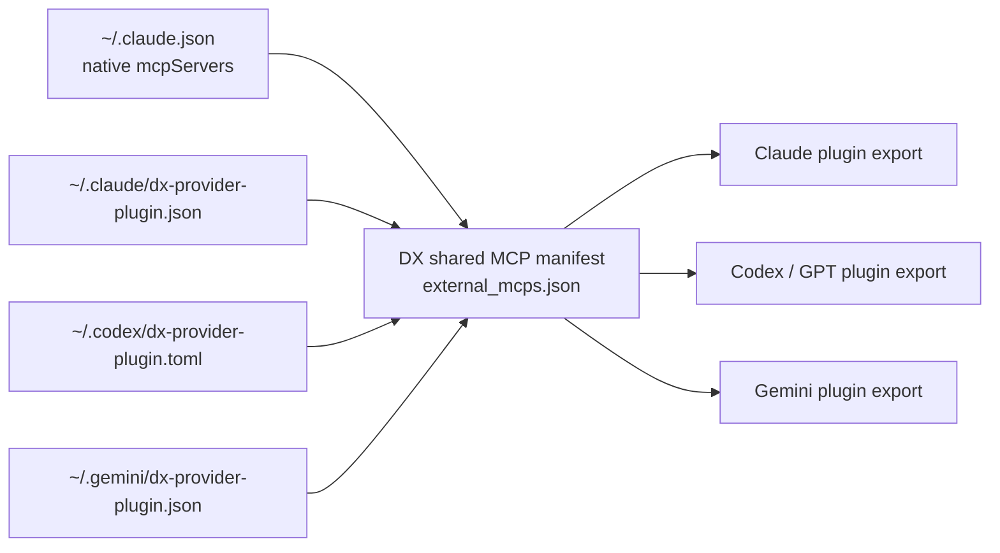

# Provider Plugin Interop

DX Terminal now treats provider interoperability as a DX-owned bridge, not a Claude-only side effect.

## Why this exists

The platform needs one shared capability catalog even when different runtimes prefer different local config shapes:

- Claude still has native MCP registrations in `~/.claude.json`
- Codex / GPT lanes need a DX-managed bridge file
- Gemini lanes need a DX-managed bridge file

That means the conversion path cannot depend on one provider being the permanent source of truth.

## Contract

The source of truth is the shared DX manifest:

- shared catalog: `~/.config/dx-terminal/external_mcps.json`
- Claude native import: `~/.claude.json`
- Claude bridge export: `~/.claude/dx-provider-plugin.json`
- Codex bridge export: `~/.codex/dx-provider-plugin.toml`
- Gemini bridge export: `~/.gemini/dx-provider-plugin.json`

Claude native MCPs are imported automatically. Provider bridge files are imported when present. The shared DX catalog is then exported back into any target bridge on demand.

## Translation Flow

## What gets translated

Each MCP record keeps:

- `name`
- `command`
- `args`
- `env`
- `description`
- `capabilities`
- `projects`
- `keywords`
- `category`
- `sources`

So a server imported from Claude can be exported into Codex or Gemini without losing routing metadata.

## DXOS surfaces

The bridge is exposed through:

- Web:
  - `GET /api/dxos/provider-plugins`
  - `POST /api/dxos/provider-plugins/sync`
- MCP:
  - `dxos_provider_plugins`
  - `dxos_provider_plugin_sync`
- Portal:
  - `Automation Catalog -> Provider Bridge Plugins`

## Operational model

Typical flows:

1. Register or discover MCPs in Claude.
2. DX imports them into the shared catalog.
3. Export the same catalog into the Codex / GPT bridge.
4. Export the same catalog into the Gemini bridge.
5. Launch provider-native DXOS lanes with the same governed capability inventory.

Reverse flow:

1. Curate or edit the Codex / Gemini bridge.
2. DX imports that bridge back into the shared catalog.
3. Export to Claude or another provider bridge as needed.

## Design boundary

This is intentionally a DX-owned plugin bridge, not an assumption that every provider already understands the same MCP config format.

That gives DX three properties:

- one canonical manifest
- provider-specific export formats
- future providers can be added without redesigning the catalog
